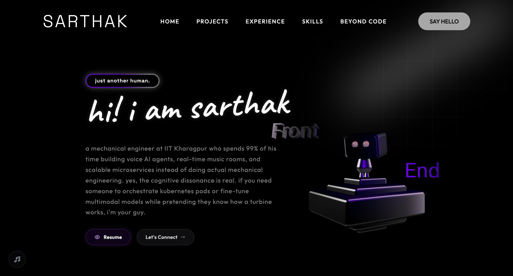
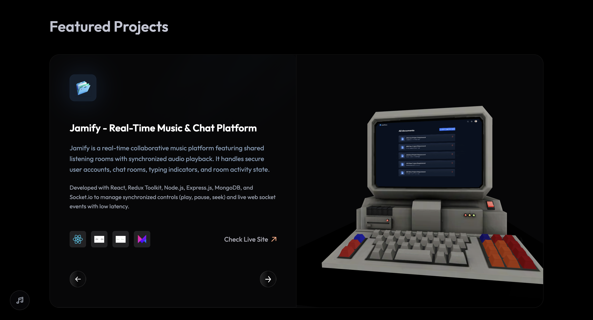
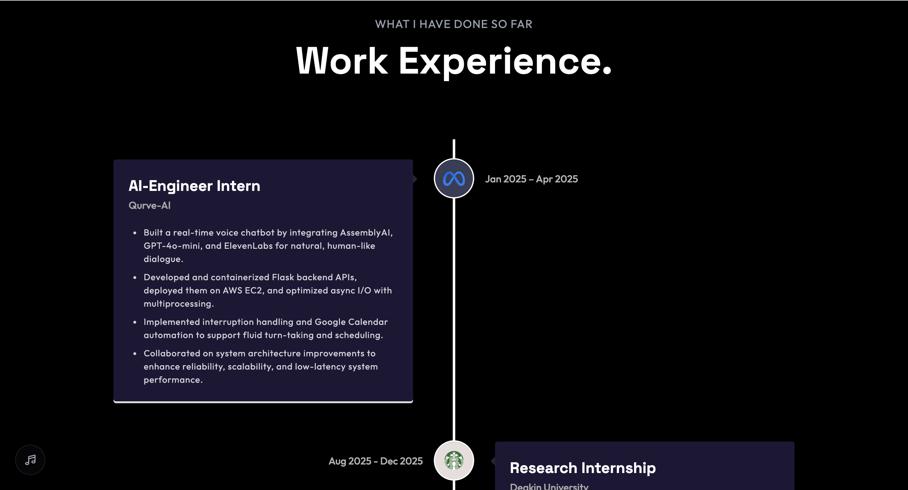
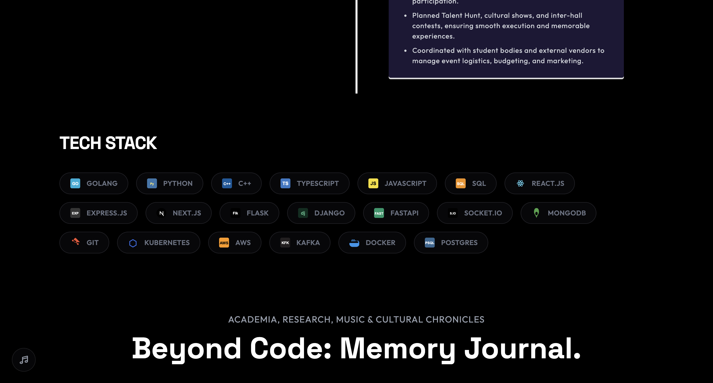
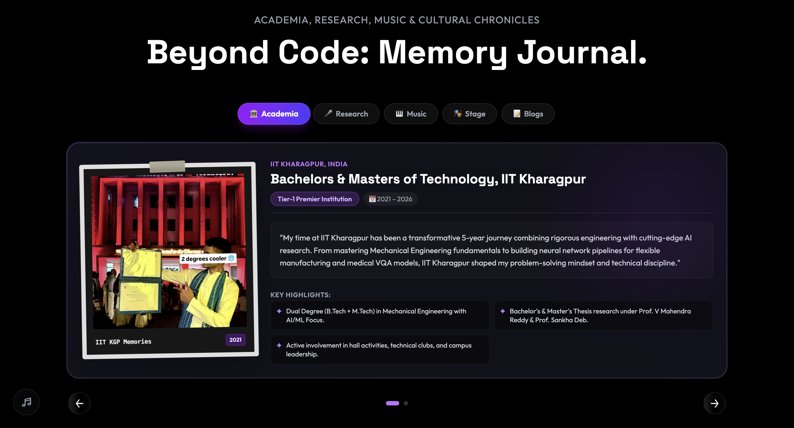
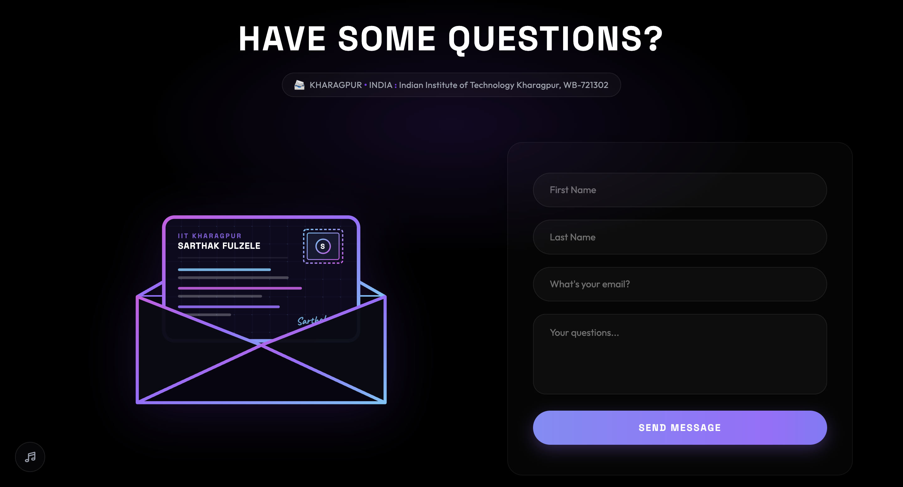
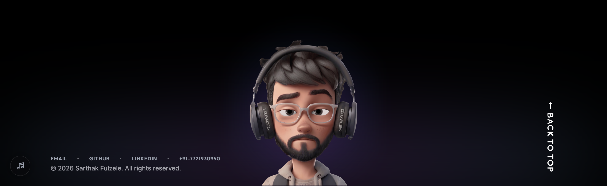

<div align="center">

# 🌌 Sarthak Fulzele — 3D Portfolio & Engineering Showcase

<p align="center">
  <b>A production-grade, immersive 3D developer portfolio & interactive memory journal.</b><br />
  Engineered with React, Three.js, React Three Fiber, Tailwind CSS, and Framer Motion — featuring real-time blog auto-sync with <a href="https://chronicle-aiso.onrender.com/">Chronicle Engine</a>.
</p>

<p align="center">
  <a href="https://sarthak1722.github.io">
    
  </a>
  <a href="https://github.com/Sarthak1722/Sarthak1722.github.io">
    
  </a>
  <a href="https://github.com/Sarthak1722/Sarthak1722.github.io/blob/main/LICENSE">
    
  </a>
</p>

<p align="center">
  
  
  
  
  
  
  
  
  
  
  
  
  
  
</p>

</div>

---

## 📸 Interactive UI Gallery & Showcase

<div align="center">

### 🌌 Hero Section & 3D Interactive Canvas

*3D Floating Developer Canvas featuring Three.js, GLTF Models, Interactive Camera & Soundscapes*

<br />

| 💻 Featured Projects Showcase | 💼 Work Experience Timeline |
| :---: | :---: |
|  <br /> *Interactive 3D Laptop Previews & Video Spotlights* |  <br /> *Qurve-AI, Deakin University & IIT KGP Leadership* |

<br />

| 🛠️ Interactive Tech Stack Grid | 🎨 Beyond Code Memory Journal |
| :---: | :---: |
|  <br /> *Modern Interactive Skills Grid with 3D Assets* |  <br /> *Memory Scrapbook, Neoclassical Piano & Live Chronicle Sync* |

<br />

| 📩 Interactive Contact Form | 🌐 Footer & Social Connections |
| :---: | :---: |
|  <br /> *Direct Inbox EmailJS Contact Form* |  <br /> *Footer & Social Links* |

</div>

---

## ✨ Key Features & Architectural Highlights

- **🛸 3D Interactive Hero Canvas**: Powered by `@react-three/fiber` and `@react-three/drei`, rendering dynamic GLTF developer models, ambient lighting, and interactive camera controls.
- **💻 Interactive 3D Project Showcase**: Real-time project previews rendered inside 3D laptop screens with synchronized MP4 video recordings and direct GitHub/Live links.
- **✍️ Real-Time Chronicle Blog Auto-Sync**: Custom React hook (`useChronicleBlogs`) that fetches live articles directly from the [Chronicle Monolith API](https://chronicle-aiso.onrender.com/api/posts) with automatic cover image resolution and fallback handling.
- **🎹 Neoclassical Piano & Harmonies Studio**: Embedded video player featuring 9 Neoclassical & Acoustic piano improvisations recorded by Sarthak.
- **🎓 Academia & Research Journal**: Highlights IIT Kharagpur Dual Degree (B.Tech + M.Tech), Youngest Presenter Title at the N0ET-2024 International Conference (IIT Dhanbad), and Deakin University Medical VQA research.
- **⚡ Glassmorphic Dark UI & Fluid Animations**: Styled with Tailwind CSS, custom backdrop filters, and Framer Motion page transitions.
- **📩 Contact Form Integration**: Integrated with EmailJS for direct inbox messaging with status notifications and responsive touch target optimization.

---

## 🛠️ Technology Stack

### Frontend & 3D Graphics
- **Framework**: React 18, Vite
- **3D Graphics & Canvas**: Three.js, `@react-three/fiber`, `@react-three/drei`, GLTF JSX
- **Styling & Motion**: Tailwind CSS, Framer Motion, Vanilla CSS Design System
- **Icons & Assets**: Lucide React, Custom SVG Icons

### Backend & Cloud Ecosystem (Projects Featured)
- **Languages**: Go, Python, JavaScript / Node.js
- **Databases & Cache**: PostgreSQL, MongoDB, Redis, Elasticsearch
- **Messaging & Async Queues**: RabbitMQ, Socket.io
- **Cloud & DevOps**: AWS S3, Docker, Kubernetes, Render, Vercel

---

## 🚀 Getting Started Locally

Follow these steps to set up and run the portfolio website on your local machine:

### Prerequisites
- **Node.js** (`>= 18.0.0`)
- **npm** (`>= 9.0.0`)

### Installation & Setup

1. **Clone the Repository**
   ```bash
   git clone https://github.com/Sarthak1722/Sarthak1722.github.io.git
   cd Sarthak1722.github.io
   ```

2. **Install Dependencies**
   ```bash
   npm install
   ```

3. **Environment Configuration**
   Create a `.env` file in the root directory and configure your EmailJS credentials:
   ```env
   VITE_APP_EMAILJS_SERVICE_ID=your_service_id
   VITE_APP_EMAILJS_TEMPLATE_ID=your_template_id
   VITE_APP_EMAILJS_PUBLIC_KEY=your_public_key
   ```

4. **Launch Development Server**
   ```bash
   npm run dev
   ```
   Open [http://localhost:5173](http://localhost:5173) in your browser.

5. **Build for Production**
   ```bash
   npm run build
   ```

---

## 📂 Repository Structure

```
Sarthak1722.github.io/
├── public/
│   ├── assets/               # SVG icons, company logos & spotlights
│   ├── images/memories/      # Scrapbook photos, piano covers & fallbacks
│   ├── models/               # Transformed 3D GLTF models
│   ├── textures/project/     # Project MP4 demo videos
│   └── ui/                   # High-resolution website UI screenshots
├── src/
│   ├── assets/               # Component visual assets
│   ├── components/           # Reusable UI (MemoryAlbum, PianoPlayer, HeroCamera, etc.)
│   ├── constants/            # Projects, work experience, & memory chapter datasets
│   ├── hooks/                # Custom React hooks (useChronicleBlogs)
│   ├── sections/             # Core page sections (Hero, Projects, BeyondCode, Contact)
│   ├── App.jsx               # Application root
│   ├── index.css             # Design tokens & glassmorphic utilities
│   └── main.jsx              # DOM entrypoint
├── index.html                # Main HTML document & meta tags
├── package.json              # Project dependencies & scripts
└── vite.config.js            # Vite build configuration
```

---

## 👨‍💻 About Sarthak Fulzele

- 🎓 **Dual Degree (B.Tech + M.Tech)** in Mechanical Engineering with AI/ML Focus from **IIT Kharagpur** (2021 – 2026).
- 🏆 **Youngest Presenter Award** at Net-Zero Emissions Technology (**N0ET-2024**) International Conference, IIT Dhanbad.
- 🔬 **AI Research & Engineering**: Medical VQA multimodal LLaVA pipelines at Deakin University & voice chatbot architecture at Qurve-AI.
- 🎹 **Harmonium & Piano**: NCA Level 6 Distinction in Harmonium & Neoclassical Piano Improvisation.

---

## 📄 License

Distributed under the **MIT License**. See `LICENSE` for details.

<div align="center">
  <sub>Built with care & precision by <a href="https://github.com/Sarthak1722">Sarthak Fulzele</a> © 2026</sub>
</div>
